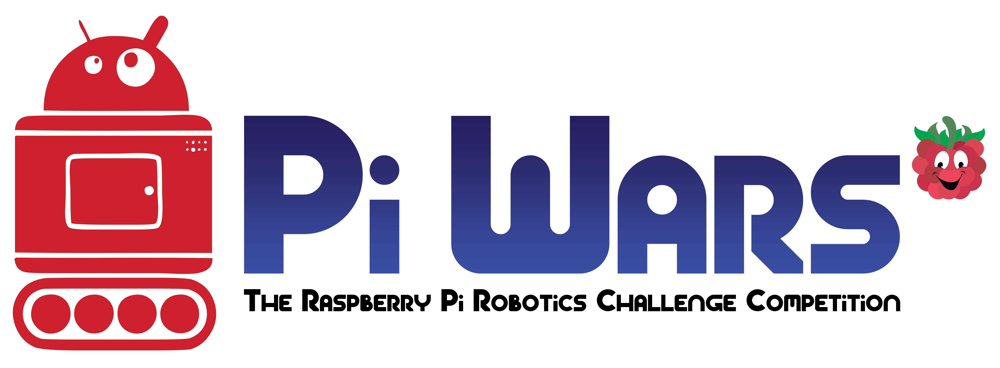
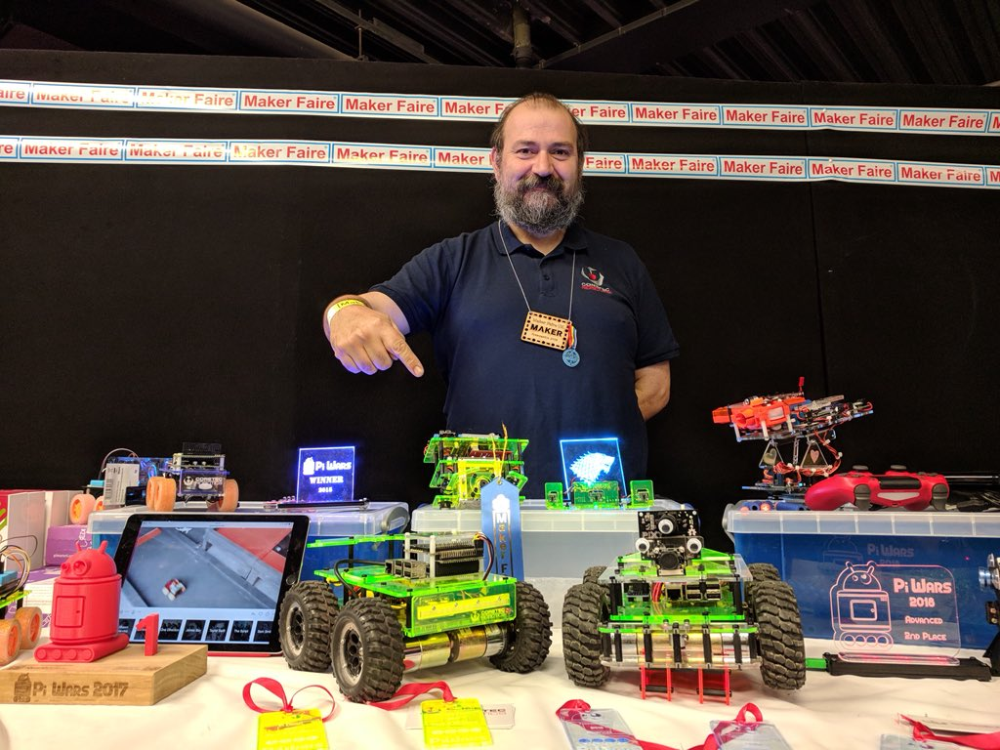
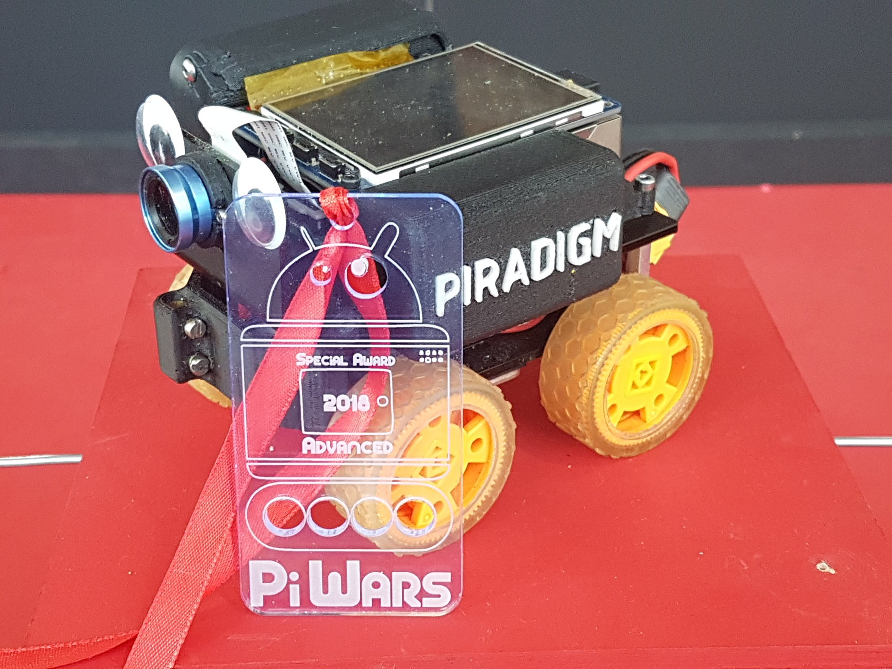

# PiWars 2018

**Author**: Brian Starkey  
**Event Date**: 21st/22nd April 2018  
**URL**: https://piwars.org  
**Tags**: `robots`, `electronics`, `raspberry pi`  

[PiWars](https://piwars.org) is an annual (4 events so far) amateur robotics competition run by Mike
Horne ([@recantha](https://twitter.com/recantha)) and Tim Richardson
([@Geeky_Tim](https://twitter.com/Geeky_Tim)). The competition has Raspberry
Pi-powered robots competing in a number of non-destructive autonomous and
remote-control challenges, with varying criteria for points and prizes.

In the more recent events, the competition has been split into a Schools &
Clubs event on the Saturday, and everyone else on the Sunday (with further
separation by experience).

PiWars first ran in 2014, and several of the teams included Makespace members.
Since then, Makespace members have competed (and in some cases won!) every
year. This year was no exception, with three of the thirty-six teams entered on
the Sunday having at least one Makespace member.

Perhaps the most successful is [Brian Corteil
(@cannonfodder)](https://twitter.com/cannonfodder) of [Coretec
Robotics](https://coretecrobotics.co.uk/), who won the 2017 and 2016
competitions overall, and this year took home second place in the
"Professionals" category overall, and first place for Technical Merit.

[This year's competition](https://piwars.org/2018-competition/rules/) had three
autonomous challenges:

 * _Somewhere Over the Rainbow_ - Using a camera (or otherwise) identify
   coloured balls in the corners of a square arena, and visit their corners in
   the correct order.
 * _Minimal Maze_ - Navigate a simple single-path maze, the layout of which is
   known ahead of time. Harder than it sounds!
 * _Straight Line Speed Test_ - Race down a straight, 7 metre course as quickly
   as possible, without touching the walls.

There were also three remote-controlled challenges, comprising:
 * _Obstacle Course_ - A complicated series of various obstacles, not known
   until the day, which must be navigated in the shortest time possible.
 * _Duck Shoot_ - Rolling balls or firing projectiles, knock down as many
   duck-shaped targets as possible, in three five-shot salvos.
 * _Slightly deranged golf_ - Get the golf ball around the course and into the
   hole, careful of the windmill!

And in a category all of its own, the only adversarial challenge:
 * _Pi Noon_ - A tournament-structured event, which pits robots head-to-head
   (under remote control). Each robot has three balloons attached, along with
   a pin on a lance. last balloon standing wins!

Apart from the "active" events, points and prizes are also awarded for technical
merit, blogging, aesthetics and other rather more esoteric metrics.

One notable entry (from a Makespace member, no less) was [Mark
Mellors'](https://twitter.com/MarkMellors) "_Piradigm_" - an audacious attempt
to [enter every single event in autonomouse
mode](http://hackhitchin.org.uk/piradigm-approach-to-piwars-challenges-2018/),
using nothing but a Pi camera for input. I think it's fair to say that it
performed better in practice runs before the event, but Mark won a Special
Award for his efforts. Perhaps most impressive was _Piradigm_'s success in
beating a human driver in the "Pi Noon" event.

Mike and Tim have not yet confirmed if the event will run next year. However,
for anyone interested in getting involved, Brian Corteil has started running a
[Robot Club](https://www.meetup.com/Makespace/events/250039440/) in Makespace on the second Saturday of each month, where budding
roboteers can get help, advice, and show off their wares (PiWars entry not
required!).
