# OpenSCAD

**Author**: Brian Starkey  
**URL**: http://www.openscad.org/  
**Tags**: `CAD`, `3D`, `printing`, `laser`, `software`  

[OpenSCAD](http://www.openscad.org/) is a 2D/3D CAD package, where designs are
constructed with code, rather than drawn. This will probably strike most people
as a terrible idea (and in some respects they'd be right), but at the same time
it allows for some constructs which would be difficult to achieve in other
ways.

OpenSCAD is Free (as in beer and speech), and available for Windows, Mac OS and
Linux, with various other ports (such as https://openjscad.org). Amongst other
formats it can export 3D parts to STL (ideal for 3D printing), and 2D to DXF
(ideal for lasering).

Check out the documentation: http://www.openscad.org/documentation.html  
The examples: http://files.openscad.org/examples/  
And the Gallery: http://www.openscad.org/gallery.html  

I'm aware of other packages which have similar features - though I don't know
much about them. [ImplicitCAD](http://www.implicitcad.org/) uses the same
language as OpenSCAD, but implements a completely different geometry engine.
[Rhino3D](https://www.rhino3d.com/) has some capacity to be scripted, and more
can be done with plugins.

## The basics

Below is the most basic OpenSCAD program, which draws a single cube, 15 mm on a
side:

```
cube(15);
```
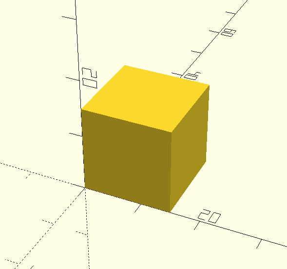

---

The transformation primitives can be used to manipulate the object:

```
translate([0, 0, 15]) rotate([0, -45, 0]) cube(15);
```
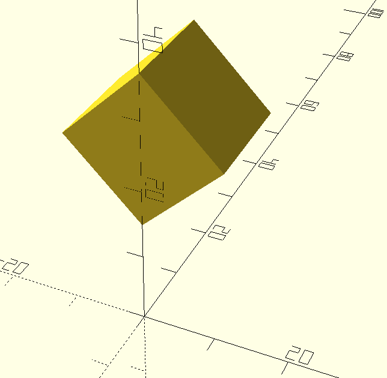

---

And boolean operations are available, to combine or subtract different objects:

```
difference() {
	translate([0, 0, 15]) rotate([0, -45, 0]) cube(15);
	cylinder(r=5, h=100);
}
```
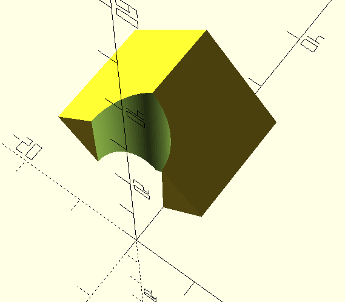

---

There are comprehensive tutorials around on the 'net - and also a series which
I created (https://github.com/usedbytes/openscad_tut) for a session I ran in
Makespace in 2014. If there's interest I'd be happy to run through the content
again.

## Libraries

Being source-code based, OpenSCAD is ideally suited to the "open source"
culture, with any number of libraries and modules available online. For example
the this: (https://github.com/cfinke/LEGO.scad) module provides primitives for
creating LEGO®-compatible parts:

```
use <LEGO.scad>

block(width=2, length=4);
```
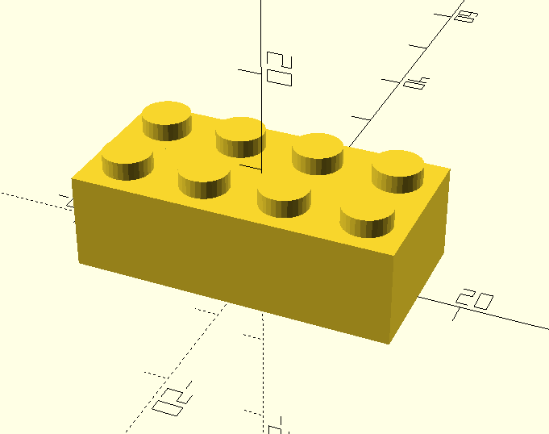

---

OpenSCAD ships bundled with MCAD (https://github.com/SolidCode/MCAD) - a large
library of useful modules for items like metric fasteners, gears and
motor/bearing/servo mounts.

```
use <MCAD/involute_gears.scad>

bevel_gear_pair(gear1_teeth=11, gear2_teeth=49, axis_angle=60, outside_circular_pitch=600);
```
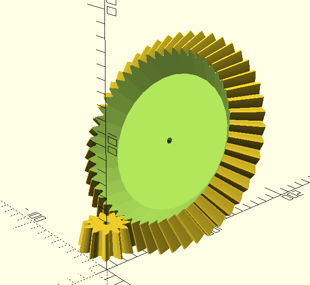

## Two dimensions

As well as 3D, OpenSCAD has a 2D subsystem, and allows extrusion from 2D to 3D,
and projection or slicing from 3D to 2D.

```
module thing() {
	rotate([40, 0, 0]) cylinder(h = 25, r = 5, center = true);
}

thing();
/* You can project all points onto the x/y plane. Like a shadow */
color("red") translate([-20, 0, 0]) projection(cut = false) thing();
/* Or only the points where z = 0, like a slice */
color("blue") translate([20, 0, 0]) projection(cut = true) thing();
```
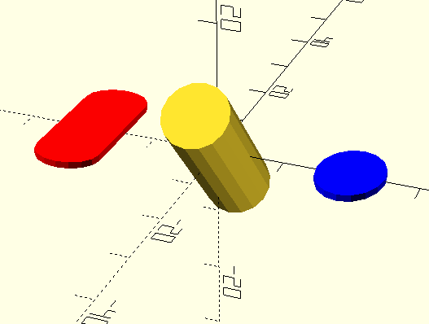

---

Combined with a capable 2D CAD package (I use
[LibreCAD](http://librecad.org/)), this allows you to draw a 2D shape, import
it into OpenSCAD, and extrude it into a 3D shape (with any number of
variations, enhancements and adjustments). Not unique to OpenSCAD, but
certainly useful:


```
linear_extrude(height = 10) import("panel_bracket.dxf");
```
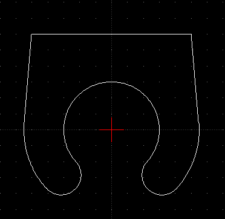
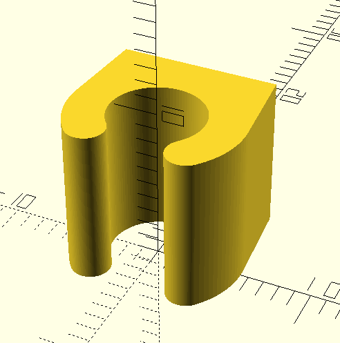


## Getting procedural

Where OpenSCAD really shines, is when you want to create something which is
easy to describe mathematically, but devilishly difficult to create in a
"normal" CAD program.

For instance, fractals or other structures which are described recursively
are a natural fit for OpenSCAD:

```
// Written in 2015 by Torsten Paul <Torsten.Paul@gmx.de>
// From the OpenSCAD examples
identity = [ [ 1, 0, 0, 0 ], [ 0, 1, 0, 0 ], [ 0, 0, 1, 0 ], [ 0, 0, 0, 1 ] ];

function rnd(s, e) = rands(s, e, 1)[0];
function mt(x, y) = [ [ 1, 0, 0, x ], [ 0, 1, 0, y ], [ 0, 0, 1, 0 ], [ 0, 0, 0, 1 ] ];
function mr(a) = [ [ cos(a), -sin(a), 0, 0 ], [ sin(a), cos(a), 0, 0 ], [ 0, 0, 1, 0 ], [ 0, 0, 0, 1 ] ];

module tree(length, thickness, count, m = identity) {
    multmatrix(m)
            cube([thickness, length, thickness]);

    if (count > 0) {
        tree(rnd(0.6, 0.8) * length, 0.8 * thickness, count - 1, m * mt(0, length) * mr(rnd(20, 35)));
        tree(rnd(0.6, 0.8) * length, 0.8 * thickness, count - 1, m * mt(0, length) * mr(-rnd(20, 35)));
    }
}

tree(100, 5, 10);
```
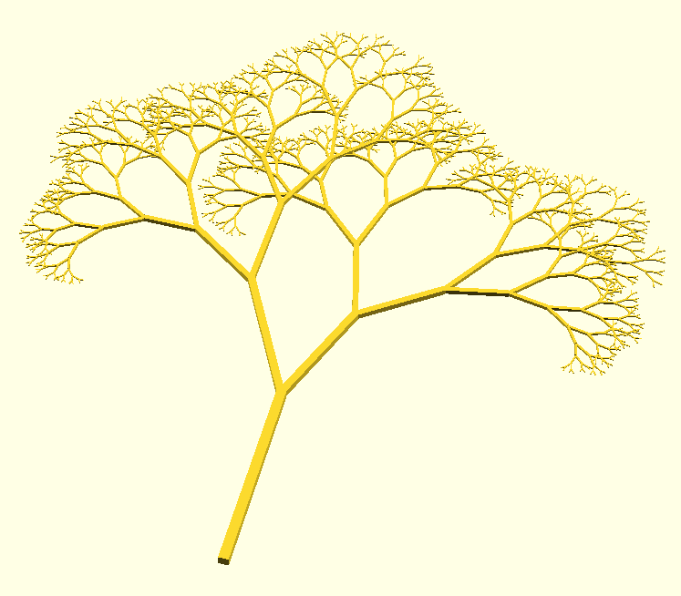

---

Or perhaps you need an egg holder which arranges them in a perfect sinusoid:

```
difference() {
	cube([240, 240, 20]);
	for (i = [0:6]) {
		translate([30 + i * 30, 30 + 180 * sin(i * 30), 30]) sphere(20);
	}
}
```
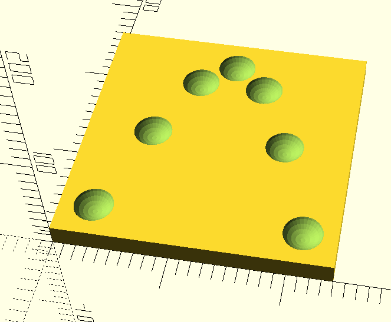

## Advanced 2D Extrusion

There's one more technique worth mentioning, which is really powerful -
`sweep()` - which can be found in
[list-comprehension-demos](https://github.com/openscad/list-comprehension-demos).

This module "sweeps" a 2D shape along a path (a list of points). The Trefoil knot example
uses a 3D function `f(a,b,t)` to generate a list of points for `t = 0:360`, and then
"sweeps" a circle along this path:

```
// https://github.com/openscad/list-comprehension-demos/blob/master/trefoil-knot-sweep.scad
use <sweep.scad>
use <scad-utils/shapes.scad>

function f(a,b,t) =   // rolling knot
 [ a * cos (3 * t) / (1 - b* sin (2 *t)),
   a * sin( 3 * t) / (1 - b* sin (2 *t)),
   1.8 * b * cos (2 * t) /(1 - b* sin (2 *t))
 ];

a = 0.8;
b = sqrt (1 - a * a);

function shape() = circle(60, $fn=48);

step = 0.005;
path = [for (t=[0:step:1-step]) 200 * f(a,b,t*360)];
path_transforms = construct_transform_path(path);
sweep(shape(), path_transforms, true);
```

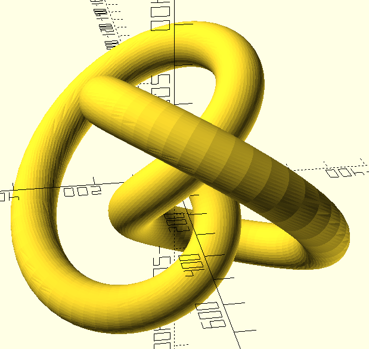

## Summary

While not suited to everyone, and not always the easiest tool to work with,
OpenSCAD is a powerful and versatile application, which it's worth considering
adding to your toolbox.
